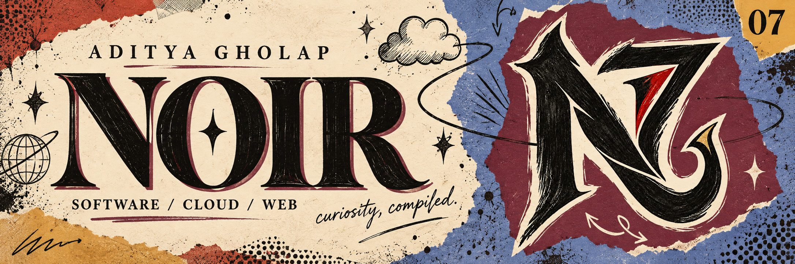

  

**Aditya Gholap / NoirPrimordial7** — software developer, cloud-computing student, and a curious mind with a taste for expressive design. 
B.Tech CSE · MIT School of Computing, MIT-ADT University · Pune, India

I build cloud-connected applications and explore how code can make sense of the world—from local services and market data to wildlife recognition.

[The projects ↓](#the-projects) &nbsp; / &nbsp; [The toolbox ↓](#the-toolbox) &nbsp; / &nbsp; [Say hello ↗](#say-hello)

<picture>
  <source media="(prefers-reduced-motion: reduce)" srcset="assets/graphics/noir-loop-still.png">
  
</picture>

## Four projects. Four different worlds.

**[MediFind / NearNest Platform ↗](https://github.com/NoirPrimordial7/nearnest)** 
A local store and service platform with sign-in flows, store registration, and separate public and admin experiences. 
REACT · VITE · FIREBASE AUTH · FIRESTORE

**[AI-Powered Market Navigator ↗](https://github.com/NoirPrimordial7/AI-Powered-Market-Navigator)** 
Stock-trend forecasting and sentiment analysis, brought together in an interactive data-visualization workflow. 
PYTHON · TENSORFLOW / KERAS · STREAMLIT · PANDAS · NUMPY

**[AI-Based Wildlife Recognition System ↗](https://github.com/NoirPrimordial7/Wild-Life-Recognition-System-)** 
Classifies wildlife in images, video frames, and webcam input, with prediction confidence, animal information, and exportable history. 
PYTHON · TENSORFLOW · OPENCV · IMAGE CLASSIFICATION

**[Eco Watch — Wildlife Classification ↗](https://github.com/NoirPrimordial7/Wild-life-detection-system)** 
A wildlife-classification project centered on environmental awareness. The public repository currently contains species labels and animal reference data. 
WILDLIFE · SPECIES DATA · ENVIRONMENTAL AWARENESS

 

| What I'm working with | Tools & technologies |
| :--- | :--- |
| **Programming** | Python · Java · JavaScript · TypeScript · C / C++ · Dart |
| **Web & apps** | React · Next.js · Vite · Flutter · HTML / CSS |
| **Cloud & backend** | AWS fundamentals · Firebase · FastAPI · PostgreSQL · Supabase · Docker |
| **Data & vision** | TensorFlow / Keras · OpenCV · YOLOv8 · Pandas · NumPy |
| **Everyday tools** | Git · GitHub · VS Code |

**Currently sharpening:** DSA, Java, Python, and AWS. **Exploring next:** Kubernetes. 
[My LeetCode learning journal ↗](https://github.com/NoirPrimordial7/-leetcode-learning-journal) — solutions, explanations, and the mistakes that taught me something.

### A little real-world grounding.

**Cloud Computing Intern · PlaceMantra Private Ltd** 
June–August 2025 · Pune 
Practical exposure to AWS fundamentals, networking, virtual machines, storage, cloud security, and deployment practices.

### Good things start with a conversation.

[GitHub ↗](https://github.com/NoirPrimordial7) &nbsp; / &nbsp; [LinkedIn ↗](https://www.linkedin.com/in/aditya-gholap-574641374) &nbsp; / &nbsp; [Email ↗](mailto:adityagholap19.06@gmail.com)

