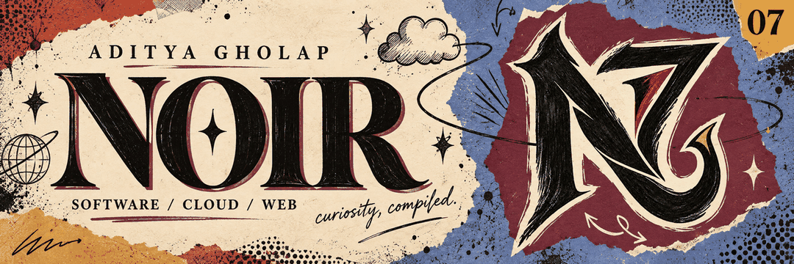
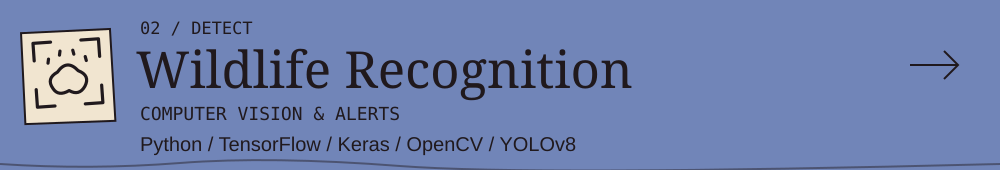
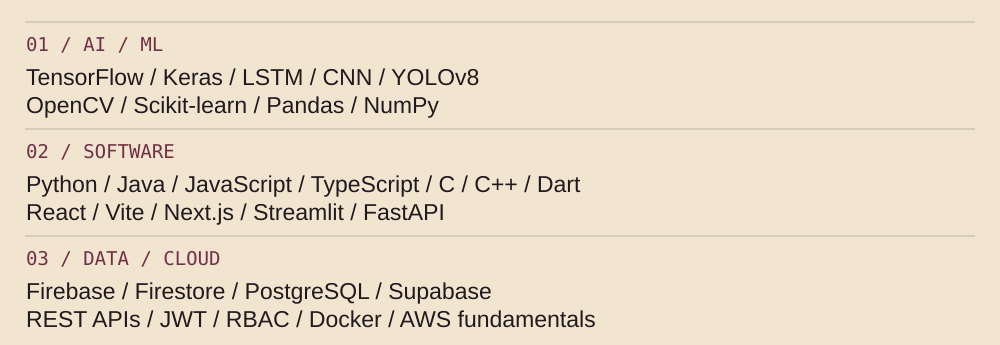

<picture>
  <source media="(prefers-reduced-motion: reduce)" srcset="assets/hero/illustrated-still.png">
  
</picture>

<h1>Aditya Gholap / NOIR</h1>

<strong>AI/ML &amp; Software Engineering · Cloud Computing</strong> 
B.Tech CSE · MIT-ADT University · Pune, India · Class of 2027

I turn data into predictions, images into signals, and ideas into software. 
My work spans machine learning, computer vision, and full-stack applications backed by cloud services.

<a href="#user-content-selected-work">Selected work ↓</a> · <a href="#user-content-system">Toolkit ↓</a> · <a href="docs/resume.md">Résumé ↗</a> · <a href="#user-content-connect">Connect ↓</a>

<h2></h2>

<strong>From models to applications.</strong> Five projects across forecasting, computer vision, local services, support workflows, and document AI.

<a href="https://github.com/NoirPrimordial7/AI-Powered-Market-Navigator"><picture><source media="(max-width: 600px)" srcset="assets/projects/market-illustrated-mobile.svg"></picture></a>

<strong>ML prototype</strong> · Explores stock-price trends with an LSTM model, technical indicators, and Reddit/news sentiment in an interactive Streamlit workflow. 
<a href="https://github.com/NoirPrimordial7/AI-Powered-Market-Navigator">Source ↗</a> · <a href="docs/cases/market.md">Inside the project ↗</a>

<a href="https://github.com/NoirPrimordial7/wildlife_intrusion_detection_system"><picture><source media="(max-width: 600px)" srcset="assets/projects/wildlife-illustrated-mobile.svg"></picture></a>

<strong>Desktop prototype</strong> · Combines YOLOv8 detection with species classification, then confirms danger events with confidence thresholds, repeated detections, and alert cooldowns. 
<a href="https://github.com/NoirPrimordial7/wildlife_intrusion_detection_system">Source ↗</a> · <a href="docs/cases/wildlife.md">Inside the project ↗</a>

<a href="https://github.com/NoirPrimordial7/nearnest-platform-2"><picture><source media="(max-width: 600px)" srcset="assets/projects/nearnest-illustrated-mobile.svg"></picture></a>

<strong>Application foundation</strong> · A local store and service platform with account flows, store registration saved to Firestore, and separate public and admin interfaces. 
<a href="https://github.com/NoirPrimordial7/nearnest-platform-2">Source ↗</a> · <a href="docs/cases/nearnest.md">Inside the project ↗</a>

<a href="https://github.com/NoirPrimordial7/ResolveX"><picture><source media="(max-width: 600px)" srcset="assets/projects/resolvex-illustrated-mobile.svg"></picture></a>

<strong>Full-stack helpdesk</strong> · A customer-support ticketing system with customer, support-agent, and admin roles, JWT/RBAC, assignment, comments, filters, and reassignment workflows. 
<a href="https://github.com/NoirPrimordial7/ResolveX">Source ↗</a> · <a href="docs/cases/resolvex.md">Inside the project ↗</a>

<a href="https://github.com/NoirPrimordial7/TenderMate-AI"><picture><source media="(max-width: 600px)" srcset="assets/projects/tendermate-illustrated-mobile.svg"></picture></a>

<strong>Tender-readiness MVP</strong> · Turns tender PDFs into AI-assisted analysis with private storage, user-scoped history, text extraction, and Gemini OCR fallback for scanned documents. 
<a href="https://github.com/NoirPrimordial7/TenderMate-AI">Source ↗</a> · <a href="docs/cases/tendermate.md">Inside the project ↗</a> · <a href="https://tender-mate-ai.vercel.app">Live app ↗</a>

<h2></h2>
<picture><source media="(max-width: 600px)" srcset="assets/graphics/system-mobile.svg"></picture>

Read the toolkit as text

<strong>AI / ML</strong> — TensorFlow · Keras · LSTM · CNN · YOLOv8 · OpenCV · Scikit-learn · Pandas · NumPy · Data analysis &amp; visualization 
<strong>Programming</strong> — Python · Java · JavaScript · TypeScript · C · C++ · Dart 
<strong>Software / backend</strong> — React · Vite · Next.js · Streamlit · FastAPI · Firebase · Firestore · PostgreSQL · Supabase · REST APIs · JWT/RBAC · Docker · Git/GitHub 
<strong>Cloud / infrastructure</strong> — AWS fundamentals · Networking · Virtual machines · Storage · Cloud security · Infrastructure management

<h2></h2>

<strong>PlaceMantra Private Ltd · Cloud Computing Intern</strong> 
June–August 2025 · Pune

Project-based exposure to AWS fundamentals, networking, virtual machines, storage, cloud security, and deployment practices, with infrastructure troubleshooting and documentation.

Education

<strong>MIT School of Computing, MIT-ADT University</strong> B.Tech CSE · Cloud Computing · 2024–2027 · CGPA: 8.0/10

<strong>AISSMS Polytechnic College, Pune</strong> Diploma in Information Technology · MSBTE · 2024 · 80.31%

<h2></h2>

Sharpening problem-solving through <a href="https://github.com/NoirPrimordial7/-leetcode-learning-journal">my DSA learning journal ↗</a>, building on AWS fundamentals, and exploring Kubernetes.

<h2></h2>

Let’s talk about machine learning, software, or an idea worth building.

<a href="https://github.com/NoirPrimordial7">GitHub ↗</a> · <a href="https://www.linkedin.com/in/aditya-gholap-574641374">LinkedIn ↗</a> · <a href="mailto:adityagholap19.06@gmail.com">Email ↗</a>

