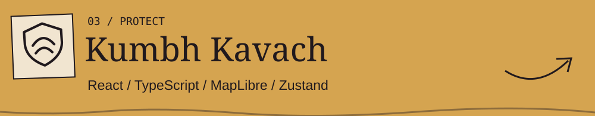

<picture>
  <source media="(prefers-reduced-motion: reduce)" srcset="assets/hero/illustrated-still.png">
  
</picture>

**Aditya Gholap / NoirPrimordial7** 
Software · Cloud · Creative Technology 
B.Tech CSE — Cloud Computing · MIT-ADT University · Pune, India

I build systems that turn ideas into working products.

[Selected work ↓](#selected-work) · [System ↓](#system) · [Résumé ↗](docs/resume.md) · [Contact ↓](#connect)

 

<h2></h2>

<a href="https://github.com/NoirPrimordial7/TenderMate-AI"><picture><source media="(max-width: 600px)" srcset="assets/projects/tendermate-illustrated-mobile.svg"></picture></a>

Turns tender PDFs into structured analysis, with authenticated workspaces, private storage, quotas and audit logging. 
[Source ↗](https://github.com/NoirPrimordial7/TenderMate-AI) · [Case notes ↗](docs/cases/tendermate.md) · [Live app ↗](https://tender-mate-ai.vercel.app)

 

<a href="https://github.com/NoirPrimordial7/ResolveX"><picture><source media="(max-width: 600px)" srcset="assets/projects/resolvex-illustrated-mobile.svg"></picture></a>

Connects students, faculty and placement administrators through role-based ticket assignment, conversations and resolution workflows. 
[Source ↗](https://github.com/NoirPrimordial7/ResolveX) · [Case notes ↗](docs/cases/resolvex.md)

 

<a href="https://github.com/NoirPrimordial7/kumbh-kavach-family-safety"><picture><source media="(max-width: 600px)" srcset="assets/projects/kumbh-illustrated-mobile.svg"></picture></a>

Explores family safety in crowded places through a working PWA with a regional map, reunion flow and simulated separation/SOS scenarios. 
[Source ↗](https://github.com/NoirPrimordial7/kumbh-kavach-family-safety) · [Case notes ↗](docs/cases/kumbh.md)

 

<a href="https://github.com/NoirPrimordial7/nearnest"><picture><source media="(max-width: 600px)" srcset="assets/projects/nearnest-illustrated-mobile.svg"></picture></a>

Connects medicine discovery with pharmacy onboarding, document verification, inventory and separate customer, store and administrator flows. 
[Source ↗](https://github.com/NoirPrimordial7/nearnest) · [Case notes ↗](docs/cases/nearnest.md)

 

---

<h2></h2>

<picture><source media="(max-width: 600px)" srcset="assets/graphics/system-mobile.svg"></picture>

Read the stack as text

**Code** — Python · Java · JavaScript · TypeScript · C++ 
**Build** — React · Next.js · Flutter 
**Backend & data** — FastAPI · Firebase · PostgreSQL · Supabase 
**Cloud** — AWS fundamentals · Docker 
**Intelligence** — TensorFlow · OpenCV · Pandas · NumPy

 

---

<h2></h2>

**PlaceMantra Private Ltd · Cloud Computing Intern** 
June–August 2025

Practical experience with AWS fundamentals, networking and deployment.

 

---

<h2></h2>

**DSA** → [My learning journal ↗](https://github.com/NoirPrimordial7/-leetcode-learning-journal) 
**AWS** → Cloud fundamentals 
**Kubernetes** → Exploring

 

---

<h2></h2>

[GitHub ↗](https://github.com/NoirPrimordial7) · [LinkedIn ↗](https://www.linkedin.com/in/aditya-gholap-574641374) · [Email ↗](mailto:adityagholap19.06@gmail.com)

